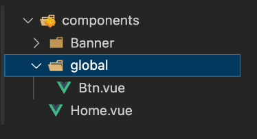

# Auto Imports 設定
---

**專寫日期 : 2024/11/05**

**相關連結 : [Auto Imports](https://nuxt.com/docs/examples/features/auto-imports)**

---

## Auto Import 範圍

Nuxt 當中，具備 auto import 特性的檔案如下 :

- `components/` : 元件目錄在 Vue 環境是自動匯入的，可直接調用。
- `composables/` : 可組合項目錄在 Vue 環境是自動匯入的，可直接調用。
- `utils/` : 通用目錄中的 JS/TS 變數和函數是自動導入的，可以直接在模板和 JS/TS 檔案中使用。
  
📌 關於上面這些檔案的補充，可參閱官網詳細說明 : [components](https://nuxt.com/docs/guide/directory-structure/components)、[composables](https://nuxt.com/docs/guide/directory-structure/composables)、[utils](https://nuxt.com/docs/guide/directory-structure/utils)

---

# Nuxt.config 調整 auto import

## 特定路徑下具備 auto import 

有時候我們不希望所有檔案都 `auto import`，僅 `特定路徑` 下自動引入時 :

Step1 : 在 `components` 資料夾下新增一個 `global` 資料夾


Step2 : 將需要自動引入的檔案放入 `components/global/` 當中



Step3 : 在 `nuxt.config.js` 中新增 `components` 設定，貼上下方程式碼

```js
export default defineNuxtConfig({
  "components": {
    "dirs": [
      {
        "path": "~/components/global",
        "global": true
      }
    ]
  }
})
```


## 新增其他 auto import 檔案夾


可以在 `nuxt.config.ts` 加入 `imports.dirs` 屬性，填上`資料夾名稱`，而原本 ~/composables/ 和 ~/urils/ 預設不會被覆蓋

```js
export default defineNuxtConfig({
  // 讓 Pinia Stores 自動引入
  "imports": {
    "dirs": ['stores']
  },
})
```

📌 Nuxt 配置說明 : [Imports](https://nuxt.com.cn/docs/api/nuxt-config#imports)

---