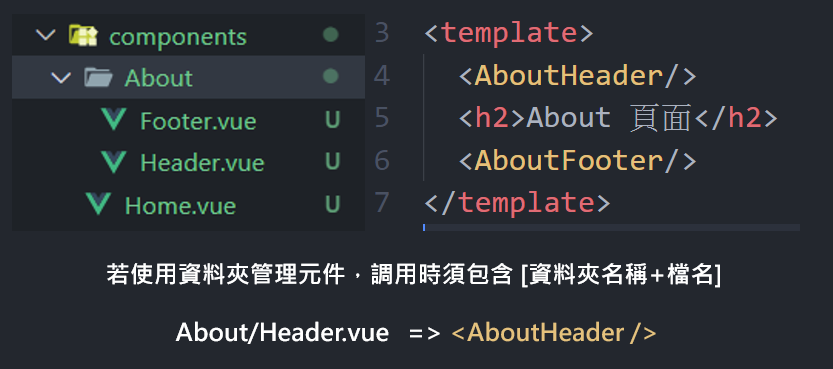

# Nuxt 基礎指令
---

**專寫日期 : 2024/11/04**

**相關連結 : 無**

---

# 基礎指令

## `nuxi add`

nuxt 僅提供預設的資料夾與功能，所以需要使用 `nuxi add` 指令擴充功能

```bash
npx nuxi add <TEMPLATE> <NAME>
```

| Options 選項 | Default 預設 | Description 說明 |
| ---  | --- | -- |
| `TEMPLATE` | - | 包含 api \| plugin \| component \| composable \| middleware \| layout \| page 等功能。 |
| `NAME`     | - | 要生成的檔案名稱與路徑 |


📌 關於 nuxi add 指令，可閱讀官方文件 : [nuxi add](https://nuxt.com/docs/api/commands/add)

---

# 指令範例

## `nuxi add page`

將專案設定為自定義的頁面步驟如下 :

1. 使用 `npx nuxi add page [檔案名稱]` 指令新增頁面
2. 將 app.vue 中的 `<NuxtWelcome />` 元件替換為 `<NuxtPage />`


```js
// 一般檔案 'pages/index.vue'
npx nuxi add page index
```

```js
// 動態路由 'pages/product/[id].vue'
npx nuxi add page "product[id]"
```

📌  關於 `<NuxtPage />` 補充，可以閱讀官方文件 : [NuxtPage](https://nuxt.com/docs/api/components/nuxt-page)

---


## `nuxi add layout`

預設專案進入點是 `App.vue`，但是當使用 `layout` 功能後，就會變成 `layouts/default.vue` 來做布局，讓切換樣板更加方便。

```js
// 生成 'layouts/default.vue'
npx nuxi add layout default
```

---

## `nuxi add component`

在 Nuxt 下的 `component` 檔案都具有 `auto import` 特性，所以不需要引入可以直接使用。

```js
// 生成 'components/Header.vue'
npx nuxi add component Header
```

```js
// 生成 'components/About/Header.vue'
npx nuxi add component About/Header
```

管理元件可以使用 `資料夾` 方式，讓一些元件拆分更加清晰，調用時請包涵 `[資料夾名稱+檔名]`



---

## `nuxi add composable`

```js
// 生成 'composable/useAddCount.ts'
npx nuxi add composable useAddCount
```
