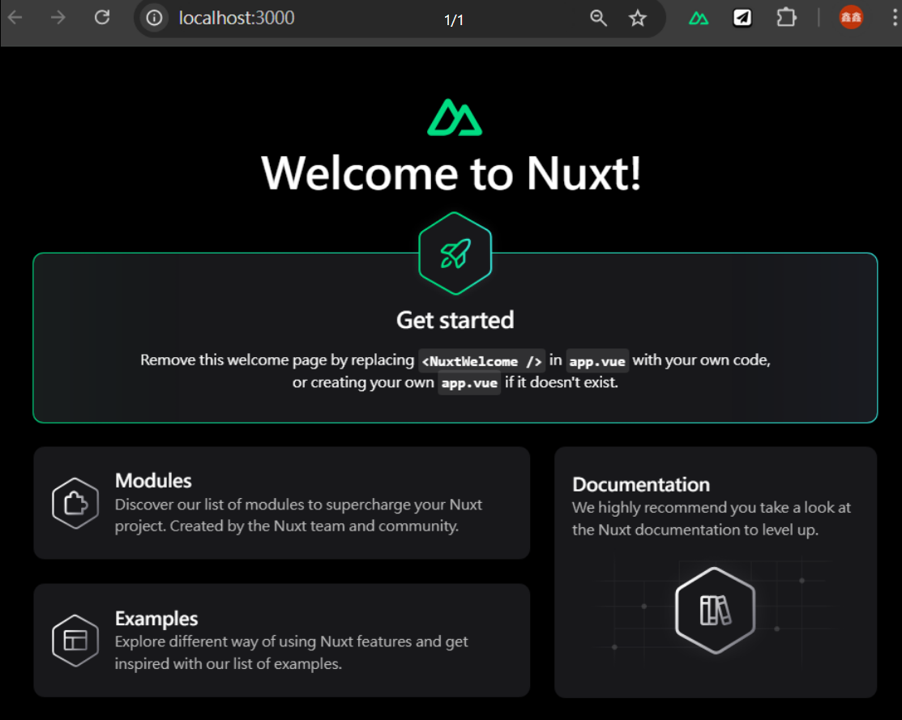

# 建立專案
---

**專寫日期 : 2024/11/04**

**相關連結 : [官方文件初始化 Nuxt - Installation](https://nuxt.com/docs/getting-started/installation)**

---

# 建立 Nuxt3 專案

## 環境準備

- [Node.js](https://nodejs.org/zh-tw) - v18 版以上，建議使用偶數 ( v18 或 v20 ) LTS 版本。
- [VSCode 編輯器](https://code.visualstudio.com/) - 並安裝 [Vue-Official](https://marketplace.visualstudio.com/items?itemName=Vue.volar) 插件。
  

## 使用指令建立專案

步驟一 :  開啟 VS Code 終端機，輸入以下指令

```bash
npx nuxi@latest init [專案名稱]
```

步驟二 : 詢問使用那種套件管理工具，這裡選 `npm` 

```bash
> Which package manager would you like to use?
● npm
○ pnpm
○ yarn
○ bun
```

步驟三 : 安裝完畢，詢問是否初始化 `Git`，建議可以選擇 `Yes`

```bash
> Initialize git respository?
● Yes / ○ No
```

步驟四 : 詢問是否安裝 `nuxi` 套件，選擇 `Yes` 安裝

```bash
❯ Initialize git repository?
● Yes / ○ No
```

步驟五 : 出現 `✨ Nuxt project has been created with the v3 template` 表示安裝成功，輸入 `cd [專案名稱]` 移動至該路徑下，運行 `npm run dev` 

```bash
cd [專案名稱]
npm run dev
```

點開http://localhost:3000/會出現以下畫面


