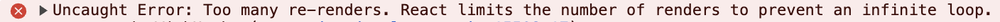
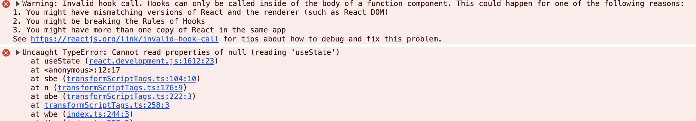
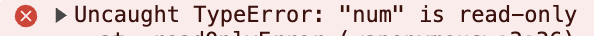
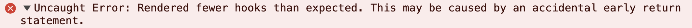

# useState

---

**專寫日期 : 2024/12/22**

**相關連結 : [React官網 - useState](https://zh-hans.react.dev/reference/react/useState)**

---

##### 目錄
- [使用方式](#使用方式)
- [參數](#參數)
- [使用 useState 注意事項](#使用-usestate-注意事項)

---

## 使用方式

```js
import { useState } from 'react'

const [state, setstate] = useState(initialState)
```

## 參數

- `initialState` : 變數的初始值，可以是純值也可以是物件。
- `state` : 當前的 state 值，初次渲染將相等於 `initialState。`
- `set函式` : 用來寫入值來更新 state 值，並觸發重新渲染。


## 使用 useState 注意事項

> [!WARNING]
> 錯誤使用 `useState` 方式 :
> - onClick 事件處理錯誤
> - 無法在元件外使用 useState
> - state 值為 `read-only`
> - 非同步、週期性事件重複觸發
> - useState 必須放在最外層

##### 1. onClick 事件處理錯誤

`onClick` 事件處理不能直接使用`()`來執行函式，否則會造成無限循環

錯誤寫法：

```jxs
// ❌ 不能在 jsx 中直接運行函式，否則會造成初次渲染錯誤
<button type="button" onClick={ add() }>+1</button>
```



正確寫法：

```jsx
// ✅ 去掉（）
<button type="button" onClick={ add }>+1</button>

// ✅ 用 () => 回傳函示
<button type="button" onClick={() => add()}>+1</button>

// ✅ 直接使用 set 函示
<button type="button" onClick={ setNum(num + 1) }>+1</button>
```

##### 2. 無法在元件外使用 useState

```jsx
// ❌ 無法在 component 外使用
const [num, setNum] = useState(0);

const App = () => {
  return (
    <>{ num }</>
  )
}
```




##### 3. state 值為 `read-only`

無法直接使用 state 值來進行修改，必須使用 set 函示來更新 state

```jsx
const App = () => {
  const [num, setNum] = useState(0);

  // ❌ state 為 read-only
  num += 1;

  return (
    <>
      {/* ❌ state 為 read-only */}  
      <button type="button" onClick={() => num++ }>+1</button>
    </>
  )
}
```



##### 4. 非同步、週期性事件重複觸發

`set` 函式觸發會造成元件刷新，當在元件最外層使用`非同步`或是 `setTimeout`、`setInterval` 等事件時，會造成重複註冊或執行。

```jsx
const App = () => {
  const [num, setNum] = useState(0);

  // ❌ 重新渲染時，最外層 setInterval 會重複註冊
  setInterval(() => {
    console.log('setInterval 運行')
  }, 1000);
  
  return (
    <>
      <button type="button" onClick={() => setNum(num + 1)}>+1</button>
    </>
  )
}
```

##### 5. useState 必須放在最外層

應避免在`條件`或`函式`等內層中使用 `usestate`，否則會發生錯誤，他只能定義在元件最外層。


```jsx
const App = () => {
  const [num, setNum] = useState(0);

  if(num > 5) {
    // ❌ 請確保 useState 是放在元件最外層
    const [text, setText] = useState('text');
  }
  
  return (
    <>
      <button type="button" onClick={() => setNum(num + 1)}>+1</button>
    </>
  )
}
```

