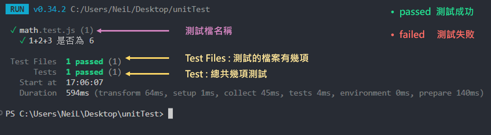

### Vitest 學習筆記
---

<details>
  <summary>目錄</summary>
  <ul>
    <li><a href="doc/01%203A測試模式.md">01 3A測試模式</a></li>
    <li><a href="doc/02%20增加更多測試及修正.md">02 增加更多測試及修正測試</a></li>
    <li><a href="doc/03%20describe%20將測試分類.md">03 describe 將測試分類</a></li>
    <li><a href="doc/04%20集成測試.md">04 集成測試</a></li>
    <li><a href="doc/05%20了解測試環境設定檔.md">05 了解測試環境設定檔</a></li>
    <li><a href="doc/06%20Matcher%20語法.md">06 Matcher 語法</a></li>
    <li><a href="doc/07%20元件測試.md">07 元件測試</a></li>
  </ul>

</details>


## 開始

安裝 Vitest

```bash
npm install -D vitest
```

## 編寫測試

建立一個 [math.js檔]() 函式計算數字相加

```js
export function add(number) {
  let sum = 0;

  for (const num of number) {
    sum += num;
  }

  return sum;
}

```

建立 [math.test.js]() 測試檔，測試 [add()]() 函式

```js
import { test, expect } from 'vitest'
// test / it 皆為 vitest 的測試函式，只是 it 為 test 的別名
// expect 斷言函式 用於定義期望結果
import { add } from './math'
// 引入要測試的函式 add()

test('測試 1+2+3 是否為 6', () => {
  const result = add([1, 2, 3]);

  expect(result).toBe(6)
  // 斷言後方加上 vitest 所提供的方法，這裡使用 .toBe()
})
// ('')引號內撰寫本次測試的期望跟目的，簡述即可。
//  第二個參數撰寫測試函式，使用箭頭函式。
```

接下來添加測試指令至你的 [package.json]() 文件中 :

```json
{
  "scripts": {
    "test": "vitest --run --reporter verbose",
    "test:watch": "vitest"
  }
}
```

基本[測試命令](https://cn.vitest.dev/guide/cli.html#vitest-run) : 

 - ```vitest --run``` 運行一次測試 (沒有監聽模式)。
 - ```vitest --run --reporter verbose``` 運行一次測試，顯示詳細測試目錄。
 - ```vitest``` 運行測試，並且開啟監聽模式 ( 程式碼更新則自動運行測試 )。


## 運行測試

執行以下程式碼來運行測試

```bash
npm test
```

