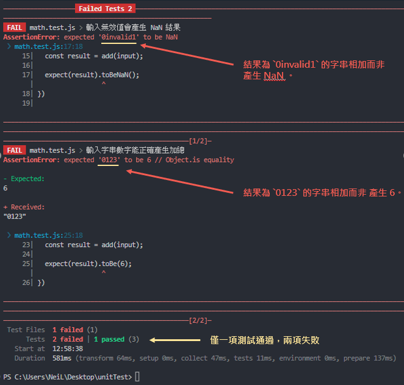
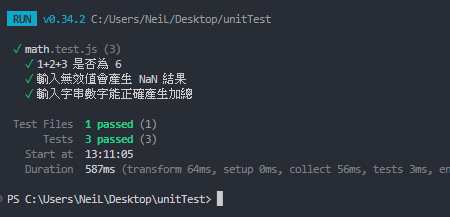

# 02 增加更多測試及修正測試
---

## 增加更多測試

> 你不應該只對單元測試只測試一件事，仍需要其他測試來避免產品發生崩潰。

回到原本的 [main.js]() 檔案，我們來對這個 [add()]() 函式增加更多測試項目來改進他。

```js
// main.js
export function add(numbers) {
  let sum = 0;

  for (const number of numbers) {
    sum += number;
  }
  return sum;
}
```

除了測試數字累加是否正常外，我們會需要處理其他意外，因此我們增加兩個測試項目。

### 1.測試輸入無效值會產生 NaN

通過規則 : 英中文及特殊符號輸入需要產生 ```NaN``` 結果。因此我們測試撰寫如下。

```js
// main.test.js
it('輸入無效值會產生 NaN 結果', () => {
  const input = ['invalid', 1];

  const result = add(input);
  
  expect(result).toBeNaN();
})
```

### 2.測試輸入 string 型別的數字依然能進行正確累加

通過規則 : 字串數字須能轉型並且正確累加。

```js
// main.test.js
it('輸入字串數字能正確產生加總', () => {
  const input = ['1', '2', '3']

  const result = add(input);

  expect(result).toBe(6);
})
```

運行 ```npm test``` 後結果



這時候需要檢查 [add()]() 函式找出問題並調整合理的結果。

```js
// main.js
export function add(number) {
  let sum = 0;

  for (const num of number) {
    sum += +num;  
    // num 前方需增加一個 + 號來強制參數轉型，也可以用 Number()
  }

  return sum;
}

```

重新運行測試 (皆 passed)



## 補充其他測試

```js
// main.test.js
it('輸入空陣列是否產生 0 的結果', () => {
  const input = [];

  const result = add(input);

  expect(result).toBe(0);
})

it('如果未輸入任何值至函數是否會抓取到錯誤', () => {
  const resultError = () => add();

  expect(resultError).toThrow();
  // toThrow() 表示如果執行時拋出錯誤，表示測試成功，反之則失敗。

  // 補充 : 
  // expect(resultFaild).not.toThrow();
  // .not 則是測試相反結果，如果你有這個測試期望可以使用
})

it('輸入多個參數至函數是否會抓取到錯誤', () => {
  const input1 = 1;
  const input2 = 2;

  const resultError = () => add(input1, input2);

  expect(resultError).toThrow();
})
```

## 錯誤類型抓取 .toThrow()

[()]() 括弧空值表示所有類型錯誤都將被抓取，如果需要抓取特定錯誤，可以使用[正規表達式]()或 [""]() 來包裹特定錯誤字串，以這個例子來說，會產生的錯誤類型為 ```number is not iterable``` ，這時候我們可以去抓取它。

```js
expect(resultError).toThrow(/number is not iterable/);
```

或者

```js
expect(resultError).toThrow('number is not iterable');
```