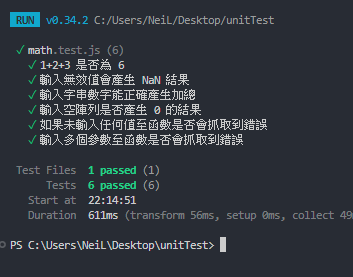
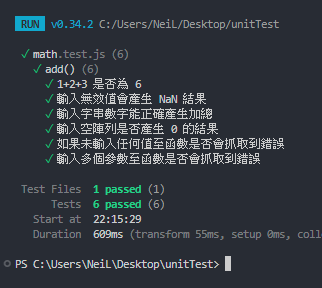

# 03 describe 將測試分類
---

## describe 分類

一個測試檔會包含許多單元，而每個單元會有許多測試，如果這些測試通通執行，系統會條列顯示所有測試內容，可一旦測試體非常龐大，發生錯誤的測試就很難推測是哪個單元。



因此，我們需要使用 ```describe``` 來分類每個測試是針對哪個 ```Function``` 。



### 語法

括弧內的描述可以寫測試的內容，但通常都直接寫函式、元件名稱，比較清楚這是針對甚麼單元。 

```js
import { describe } from 'vitest';

describe('分類描述', () => {
  ...測試A ;
  ...測試B ;
})
```

套用先的 [math.test.js]() 就會像是這樣

```js
// math.test.js
import { it, expect, describe } from 'vitest';
import { add } from './math';

describe('add()',  () => {
  it('1+2+3 是否為 6', () => {
    const input = [1, 2, 3];
  
    const result = add(input);
  
    expect(result).toBe(6);
  })
  
  it('輸入無效值會產生 NaN 結果', () => {
    const input = ['invalid', 1];
  
    const result = add(input);
  
    expect(result).toBeNaN();
  })
  
  it('輸入字串數字能正確產生加總', () => {
    const input = ['1', '2', '3']
  
    const result = add(input);
  
    expect(result).toBe(6);
  })
  
  it('輸入空陣列是否產生 0 的結果', () => {
    const input = [];
  
    const result = add(input);
  
    expect(result).toBe(0);
  })
  
  it('如果未輸入任何值至函數是否會抓取到錯誤', () => {
    const resultError = () => add();
  
    expect(resultError).toThrow();
    // toThrow() 表示如果執行時拋出錯誤，表示測試成功，反之則失敗。
  
    // 補充 : 
    // expect(resultFaild).not.toThrow();
    // .not 則是測試相反結果，如果你有這個測試期望可以使用
  })
  
  it('輸入多個參數至函數是否會抓取到錯誤', () => {
    const input1 = 1;
    const input2 = 2;
  
    const resultError = () => add(input1, input2);
  
    expect(resultError).toThrow('number is not iterable');
  })
})
```