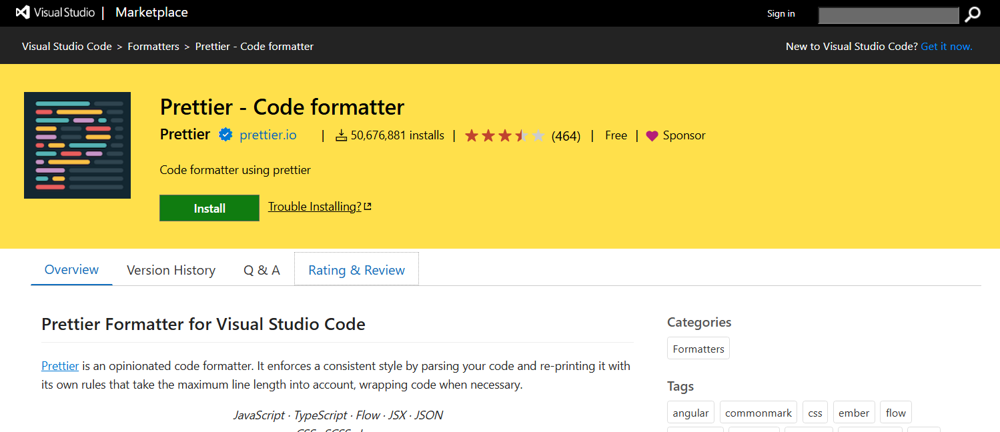
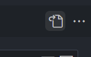

# Prettier - 代碼縮排格式化
---



在撰寫程式碼的過程中，每個開發者對於程式碼編排的喜好都不相同，若共同開發過程縮排不一致，容易產生許多問題 (ex.可讀性...、)，因此使用 Prettier 來控管縮排規則，讓程式碼更為統一，


## 建立設定檔

步驟一 : VSCode 編輯器安裝 [Prettier](https://marketplace.visualstudio.com/items?itemName=esbenp.prettier-vscode) 插件

步驟二 : 依序開啟 `檔案` > `喜好設定` > `設定`

步驟三 : 選擇 `工作區` (表示僅該專案執行設定，且該設定會跟著專案走)

步驟四 : 點擊右上角 `開啟設定JSON` 的圖示，產生一個`.vscode/settings.json` 檔案



步驟五 : 開啟 `.vscode/settings.json` 檔案，複製下方縮排設定後結束

```json
{
"editor.defaultFormatter": "esbenp.prettier-vscode",
 "[javascript]": {
     "editor.formatOnSave": true,
     "editor.defaultFormatter": "esbenp.prettier-vscode"
 },
 "[vue]": {
     "editor.formatOnSave": true,
     "editor.defaultFormatter": "esbenp.prettier-vscode"
 },
 "[css]": {
     "editor.formatOnSave": true,
     "editor.defaultFormatter": "esbenp.prettier-vscode"
 },
 "[scss]": {
     "editor.formatOnSave": true,
     "editor.defaultFormatter": "esbenp.prettier-vscode"
 },
 "[html]": {
     "editor.formatOnSave": true,
     "editor.defaultFormatter": "esbenp.prettier-vscode"
 },
 "prettier.disableLanguages": []
}

```